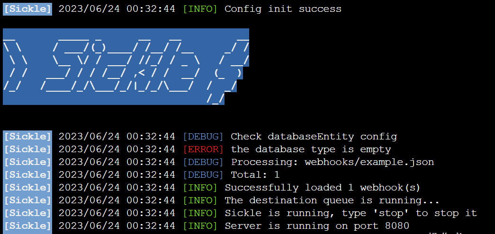
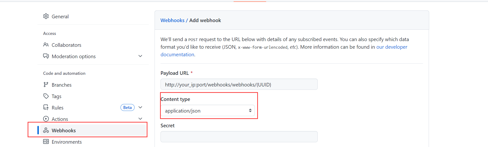

```
__       _____ _      __   __         __
\ \     / ___/(_)____/ /__/ /__     _/ /
 \ \    \__ \/ / ___/ //_/ / _ \   / __/
 / /   ___/ / / /__/ ,< / /  __/  (_  )
/_/   /____/_/\___/_/|_/_/\___/  /  _/
                                 /_/
```


[](https://discord.com/invite/zY2c9B78)


本项目的作用是统合各平台的webhooks，例如GitHub, Slack等，并且转发到不同平台的集成平台，例如IFTTT, Discord, Wecom Bot等

##  欢迎

欢迎来到Sickle, 一个用于统合webhooks的项目, 这个项目刚刚起步, 使用Go语言开发, 你可以在这里找到一些有用的信息. 如果你有任何问题,
请随时提出issue. 或者通过邮件联系我: [Pama Lee](mailto:pama@pamalee.cn)

## 功能

- 支持多种webhooks来源和目标平台
- 支持自定义webhooks的格式和内容
- 支持过滤和转换webhooks的数据
- 支持日志和错误处理

## 安装

你可以使用以下命令克隆这个仓库到你的本地：

```bash
git clone https://github.com/Pama-Lee/Sickle.git
```

## 安装依赖

```bash
go mod tidy
```

## 运行

1. 从源代码运行

```bash
go run Sickle
```

2. 从二进制文件运行
   您可自行编译二进制文件，或者从[Release](https://github.com/Pama-Lee/Sickle/releases)下载已编译的二进制文件。

```bash
./Sickle
```

## 🤔如何使用

1. 运行Sickle
   推荐在`Linux`或`MacOS`上运行Sickle，你可以使用`nohup`命令在后台运行Sickle：

```bash
nohup ./Sickle &
```



在首次运行Sickle时, 会自动创建一个`./webhooks`文件夹, 用于存放webhooks的配置文件, 你可以在这里配置你的webhooks来源和目标平台。
并且会在`./webhooks`文件夹中创建一个`example.json`文件, 用于配置示例, 你可以参考这个文件来配置你的webhooks。

2. 配置webhooks及获取UUID
   当运行Sickle后, Sickle会自动读取`./webhooks`文件夹中的配置文件, 并且会给每个配置文件分配一个UUID, 你可以在配置文件中查看你的UUID。

UUID是类似这样的字符串:`784db24b-e9fb-4e4f-8b7d-fac84500a9af`

3. 在webhooks来源平台配置webhooks

你可以在webhooks来源平台配置webhooks,并且将webhooks的目标地址设置为`http://your_ip:port/webhooks/webhooks/{UUID}`
> 如果您为Sickle配置了域名, 请将`your_ip`替换为您的域名

例如, 您要配置Github的webhooks, 您可以在Github的webhooks配置页面配置webhooks,
并且将webhooks的目标地址设置为`http://your_ip:port/webhooks/webhooks/{UUID}`

**❗注意**: 请将`Content type`设置为`application/json`



4. 还差一步

此时Sickle已经可以接收webhooks, 但是Sickle并不知道你想要将webhooks转发到哪里, 你需要在`./webhooks`
文件夹中的配置文件中配置你的webhooks目标平台。

例如, 您要将Github的webhooks转发到IFTTT, 您需要在`./webhooks`文件夹中的配置文件中配置你的IFTTT的webhooks,

例如`IFTTT`的webhooks链接是`https://maker.ifttt.com/trigger/{event}/with/key/{key}`
> 请将`{event}`替换为你的事件名称, 将`{key}`替换为你的key

你可以在`./webhooks`文件夹中的配置文件中配置你的IFTTT的webhooks, 并且将`webhooks`的`url`
设置为`https://maker.ifttt.com/trigger/{event}/with/key/{key}`

### 🎇大功告成

## 配置

1. 使用config文件配置

你可以在`./webhooks/{project}.json`中配置你的webhooks来源和目标平台，例如：

```json
    {
      "name": "Webhook 1",
      "url": "",
      "uuid": "",
      "source": {
        "type": "source_platform",
        "config": {
          "events": [
            {
              "name": "event1",
              "key": "data.event.event_name",
              "destinations": ["destination_platform_1"]
            },
            {
              "name": "event2",
              "key": "data.event.event_name",
              "destinations": [
                "destination_platform_1"
              ]
            }
          ]
        }
      },
      "destinations": [
        {
          "name": "destination_platform_1",
          "type": "destination_platform_1",
          "config": {
            "webhook_url": "https://destination1.com",
            "method": "POST",
            "headers": {
              "User-Agent": "Sickle"
            },
            "data": [
              {
                "event": "event1",
                "data": {
                    "value1": "sickle.data.event.data.value1",
                    "value2": "sickle.data.event.data.value2"
                }
              }, {
                "event": "event2",
                "data": {
                    "value1": "sickle.data.event.data.value1",
                    "value2": "sickle.data.event.data.value2"
                }
              }
            ]
          }
        }
      ]
    }

```

### 配置说明

<mark>正在规划制作在线配置生成器</mark>

> 下面包含的数据键的说明：你可以在`./request/{name}_{UUID}.json`中查看你的webhooks的数据键。
> 这个文件是在第一次webhooks抵达时自动按照请求体生成的,
> 帮助你定位数据。 如果你的webhooks没有抵达过, 你可以使用下面的例子参考

例如，如果你的webhooks请求体是这样的：

```json
{
  "event": {
    "event_name": "event1",
    "data": {
      "value1": "value1",
      "value2": "value2"
    }
  }
}
```

那么你的`./request/{name}_{UUID}.json`文件将是这样的：

```json
{
  "event.event_name": "event1",
  "event.data.value1": "value1",
  "event.data.value2": "value2"
}
```

> 你可以在`./request/{name}_{UUID}.json`中查看你的webhooks的数据键。

> 关于定位事件数据的说明：如果事件被包含在headers中, 则使用`sickle.headers.{header名称}`来定位数据,
> 否则直接使用`./request/{name}_{UUID}.json`中的数据键来定位数据。


以下是配置文件的详细说明:

- `name`（字符串）: Webhook的名称。
    - `url`（字符串）: 运行后生成的Webhook URL。
    - `source`（对象）: 指定Webhook的来源平台配置。
        - `type`（字符串）: 指定来源平台的类型。
        - `config`（对象）: 配置来源平台的详细信息，包括事件和目标配置。
            - `events`（数组）: 包含一个或多个事件的列表。每个事件对象包括以下属性：
                - `name`（字符串）: 事件的名称。
                - `key`（字符串）: 事件的关键字(在`./request/{name}_{UUID}.json`中查看, 用于定位事件的数据,
                  如果事件被包含在headers中,
                  则使用`sickle.headers.{header名称}`来定位数据)。
                - `destinations`（数组）: 事件触发时要发送到的目标平台列表。
    - `destinations`（数组）: 包含一个或多个目标平台的列表。每个目标平台对象包括以下属性：
        - `name`（字符串）: 目标平台的名称。
        - `type`（字符串）: 目标平台的类型。
        - `config`（对象）: 目标平台的配置信息，包括Webhook URL和自定义数据。
            - `webhook_url`（字符串）: 目标平台的Webhook URL。
            - `method`（字符串）: Webhook的请求方法。
            - `data`（数组）: 包含一个或多个自定义数据的列表。每个自定义数据对象包括以下属性：
                - `event`（字符串）: 事件的名称(便于实现多个事件共用一个目标平台的配置)
                - `data`（对象）: 自定义数据对象。
                    - `自定义数据名称`（字符串）: 自定义数据的值。你可以使用`${传入数据键}`来引用来源平台的数据,
                      具体来源平台的数据键可以在`./request/{name}_{UUID}.json`中查看。
                    - `自定义数据名称2`（字符串）: 自定义数据的值2。


2. 在web页面配置

<mark>暂未实现</mark>


## 贡献

### 贡献模板

```markdown
# 贡献者

name: Pama-Lee

# 贡献内容

- [x] 功能1
- [ ] 功能2
```

### 贡献过程

1. fork 这个仓库
2. 将分叉的存储库克隆到本地
3. 新建分支
4. 做出改变
5. 提交你的改变
6. 将您的更改推送到远程存储库
7. 创建拉取请求
8. 等待审核

## 执照

[MIT](./LICENSE)